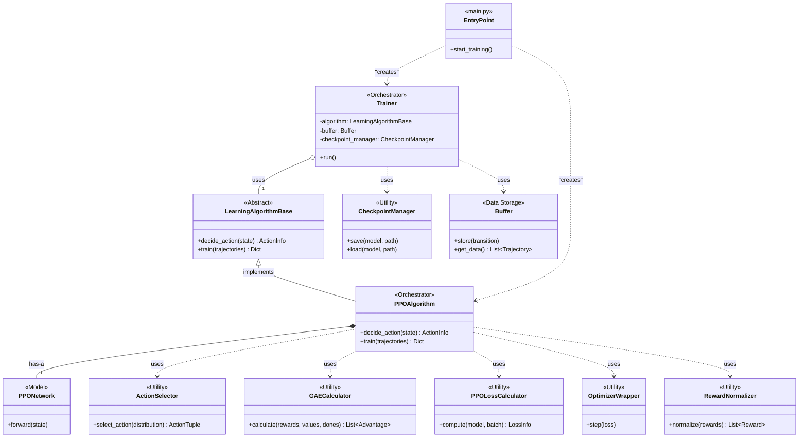

```mermaid

classDiagram

    %% --- ① 中核インターフェース ---
    class LearningAlgorithmBase {
        <<Abstract>>
        +decide_action(state) ActionInfo
        +train(trajectories) Dict
    }

    %% --- ② オーケストレーター（指揮者）クラス ---
    class PPOAlgorithm {
        <<Orchestrator>>
        +decide_action(state) ActionInfo
        +train(trajectories) Dict
    }
    class Trainer {
        <<Orchestrator>>
        -algorithm: LearningAlgorithmBase
        -buffer: Buffer
        -checkpoint_manager: CheckpointManager
        +run()
    }

    %% --- ③ PPOの専門家（Specialist）コンポーネント群 ---
    class ActionSelector {
        <<Utility>>
        +select_action(distribution) ActionTuple
    }
    class GAECalculator {
        <<Utility>>
        +calculate(rewards, values, dones) List~Advantage~
    }
    class PPOLossCalculator {
        <<Utility>>
        +compute(model, batch) LossInfo
    }
    class OptimizerWrapper {
        <<Utility>>
        +step(loss)
    }
    class RewardNormalizer {
        <<Utility>>
        +normalize(rewards) List~Reward~
    }
    class PPONetwork {
        <<Model>>
        +forward(state)
    }

    %% --- ④ インフラストラクチャ（基盤）コンポーネント群 ---
    class CheckpointManager {
        <<Utility>>
        +save(model, path)
        +load(model, path)
    }
    class Buffer {
        <<Data Storage>>
        +store(transition)
        +get_data() List~Trajectory~
    }
    
    %% --- ⑤ エントリーポイント（組立役） ---
    class EntryPoint {
        <<main.py>>
        +start_training()
    }

    %% --- 関係性の定義 ---
    %% 実装関係
    LearningAlgorithmBase <|-- PPOAlgorithm : implements

    %% PPOAlgorithmは専門家たちを指揮する
    PPOAlgorithm *-- "1" PPONetwork : has-a
    PPOAlgorithm ..> ActionSelector : uses
    PPOAlgorithm ..> GAECalculator : uses
    PPOAlgorithm ..> PPOLossCalculator : uses
    PPOAlgorithm ..> OptimizerWrapper : uses
    PPOAlgorithm ..> RewardNormalizer : uses

    %% Trainerはアルゴリズムのインターフェースとインフラを利用する
    Trainer o-- "1" LearningAlgorithmBase : uses
    Trainer ..> CheckpointManager : uses
    Trainer ..> Buffer : uses

    %% EntryPointがすべてを組み立てる
    EntryPoint ..> Trainer : "creates"
    EntryPoint ..> PPOAlgorithm : "creates"
```